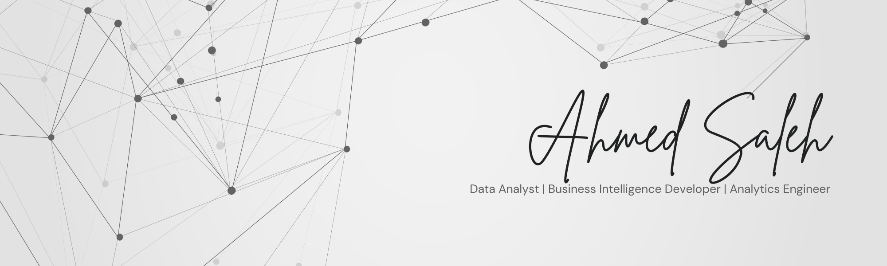

<!--
**ai-saleh/ai-saleh** is a ✨ _special_ ✨ repository because its `README.md` (this file) appears on your GitHub profile.

Here are some ideas to get you started:

- 🔭 I’m currently working on ...
- 🌱 I’m currently learning ...
- 👯 I’m looking to collaborate on ...
- 🤔 I’m looking for help with ...
- 💬 Ask me about ...
- 📫 How to reach me: ...
- 😄 Pronouns: ...
- ⚡ Fun fact: ...
-->

## Hi there! 👋

I'm Ahmed. I come from an engineering background and I've found my passion in working with data. I have expertise in analytics and reporting, query development, and data modeling.

### 🛠️ Tech Stack

#### Languages & Databases

#### Analytics & BI Tools

#### Libraries & Frameworks

### 📚 Projects

| Project | Description | Tools |
|----------|-------------|--------|
| [Internet Sales Analytics](https://github.com/ai-saleh/internet-sales-analytics) | End-to-end BI solution using Power BI and SQL Server, built with star schema modeling to track sales, customer, and product performance against budget targets |    |
| [Coffee Beans Sales Analysis](https://github.com/ai-saleh/coffee-sales-analysis) | Excel-based sales analysis solution that integrates data sources to track customer sales, product performance metrics, and geographic sales distribution with interactive filtering capabilities |    |

> 🚧 I'm working on expanding my portfolio with new projects

### 📫 Let's Connect!

